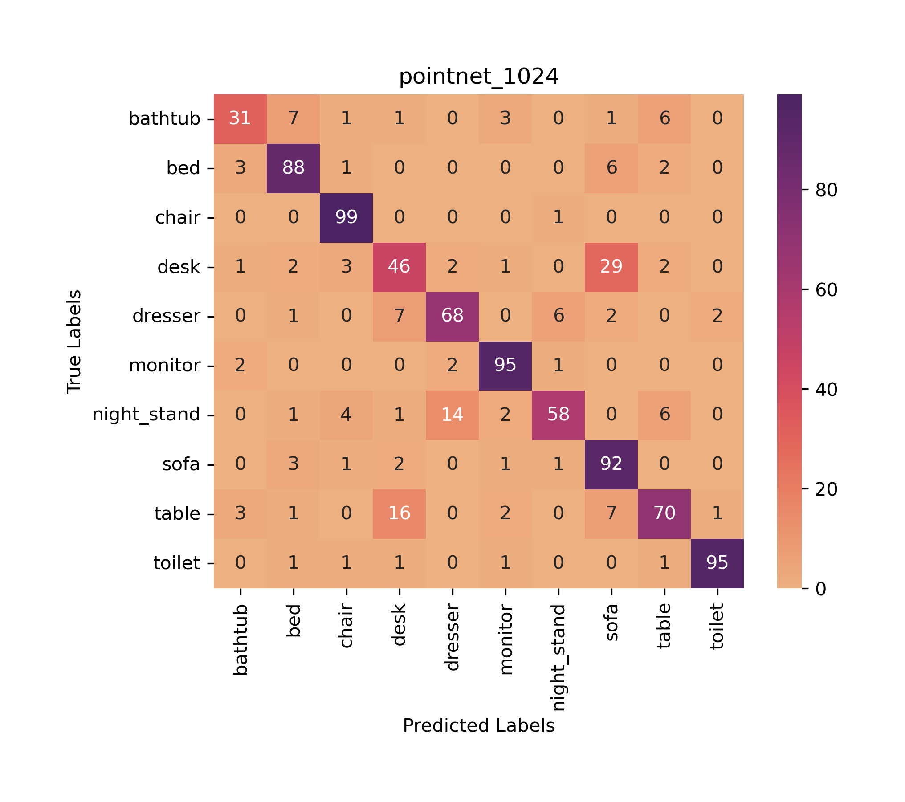
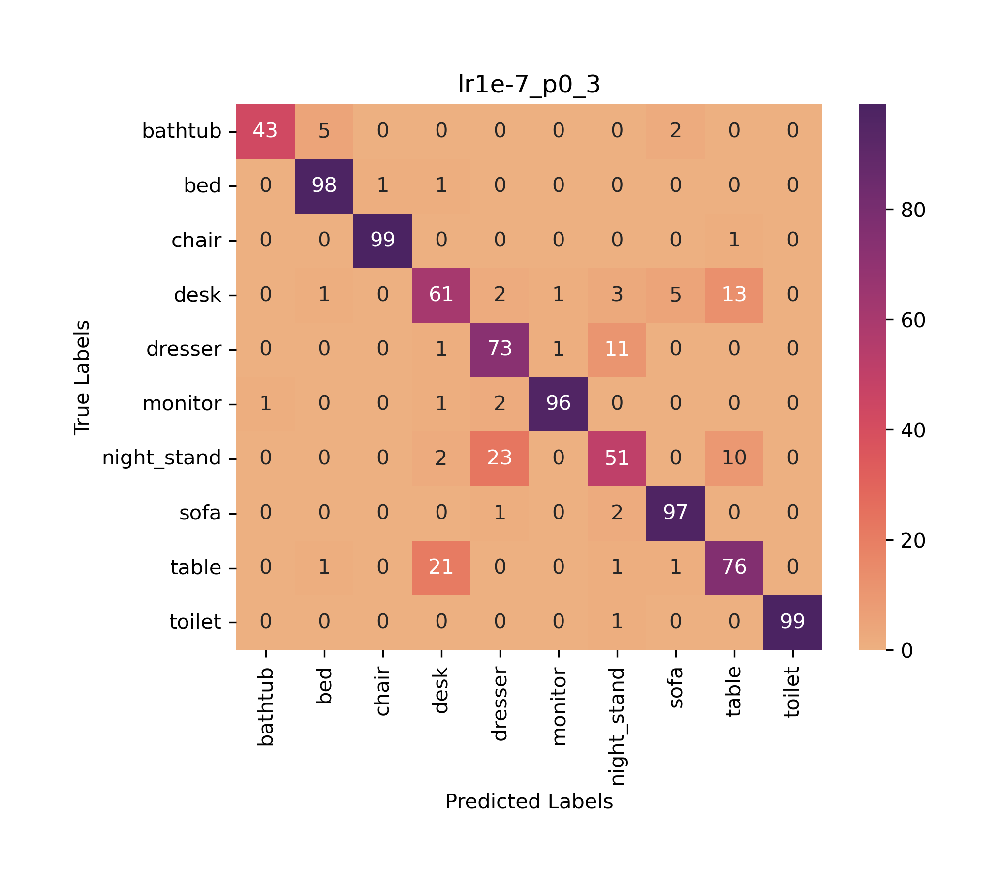

## Orientation-boosted VoxNet vs PointNet
Attempt to implement Orion VoxNet in PyTorch by N. Sedaghat, M. Zolfaghari, E. Amiri, and T. Brox, “Orientationboosted voxel nets for 3d object recognition” and compare it a to PointNet implemented in PyTorch by fxia22

| PointNet                          | Orion                       |
| ----------------------------------- | ----------------------------------- |
|  |  |
